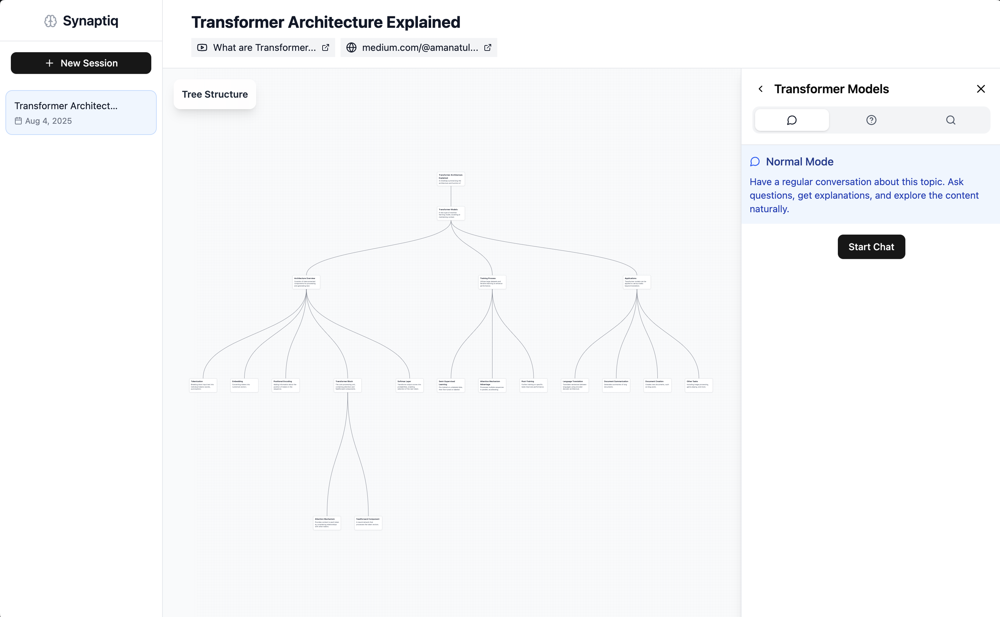

# Synaptiq

Zihin haritalarını kullanarak etkileşimli soru-cevap olanağı sağlayan yapay zeka destekli öğrenme asistanı. Synaptiq, bilgiyi görsel zihin haritaları aracılığıyla organize etmenize ve geliştirilmiş öğrenme için akıllı sohbet tabanlı etkileşimler sağlamanıza yardımcı olur.



## Kullanılan Teknolojiler

### Backend
- **FastAPI** - Modern Python web framework'ü
- **LangChain** - Yapay Zeka/LLM entegrasyon framework'ü
- **ChromaDB** - Anlamsal arama için vektör veritabanı
- **SQLite** - Yerel veritabanı depolama

### Frontend
- **React** + **TypeScript** - Modern web framework'ü
- **Vite** - Hızlı derleme aracı
- **TailwindCSS** - Utility-first CSS framework'ü
- **React Query** - Veri getirme ve önbelleğe alma

## Kurulum

### Backend Kurulumu

1. API dizinine gidin:
```bash
cd api
```

2. Sanal ortam oluşturun:
```bash
python -m venv venv
source venv/bin/activate  # Windows'ta: venv\Scripts\activate
```

3. Paketleri yükleyin:
```bash
pip install -r requirements.txt
```

4. `api` dizininde bir `.env` dosyası oluşturun:
```env
# Ortam değişkenlerinizi buraya ekleyin
# Örnek:
# TAVILY_API_KEY=your_tavily_api_key_here
# GOOGLE_API_KEY=your_google_api_key_here
```

5. Backend sunucusunu başlatın:
```bash
python main.py
```

API `http://localhost:6463` adresinde kullanılabilir olacaktır

### Frontend Kurulumu

1. Client dizinine gidin:
```bash
cd client
```

2. Paketleri yükleyin:
```bash
npm install
```

3. Sunucuyu başlatın:
```bash
npm run dev
```

Frontend `http://localhost:5173` adresinde kullanılabilir olacaktır

## Proje Yapısı

```
synaptiq/
├── api/                    # Backend FastAPI uygulaması
│   ├── routes/            # API route işleyicileri
│   ├── services/          # İş mantığı servisleri
│   ├── database/          # Veritabanı istemcisi ve şemaları
│   ├── vectorstore/       # ChromaDB vektör deposu istemcisi
│   └── main.py           # Uygulama giriş noktası
└── client/                # Frontend React uygulaması
    ├── src/
    │   ├── components/    # React bileşenleri
    │   ├── service/       # API istemcisi ve sorgular
    │   └── lib/          # Yardımcı fonksiyonlar
    └── public/           # Statik varlıklar
```

## Lisans

Bu proje MIT Lisansı altında lisanslanmıştır.
