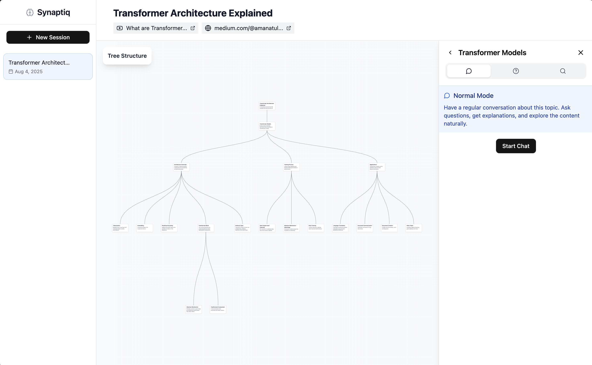

# Synaptiq

An AI-powered learning assistant that enables interactive Q&A using mindmaps. Synaptiq helps you organize knowledge through visual mindmaps and provides intelligent chat-based interactions for enhanced learning.



## Tech Stack

### Backend
- **FastAPI** - Modern Python web framework
- **LangChain** - AI/LLM integration framework
- **ChromaDB** - Vector database for semantic search
- **SQLite** - Local database storage

### Frontend
- **React** + **TypeScript** - Modern web framework
- **Vite** - Fast build tool
- **TailwindCSS** - Utility-first CSS framework
- **React Query** - Data fetching and caching

## Installation

### Backend Setup

1. Navigate to the API directory:
```bash
cd api
```

2. Create a virtual environment:
```bash
python -m venv venv
source venv/bin/activate  # On Windows: venv\Scripts\activate
```

3. Install dependencies:
```bash
pip install -r requirements.txt
```

4. Create a `.env` file in the `api` directory with your configuration:
```env
# Add your environment variables here
# Example:
# TAVILY_API_KEY=your_tavily_api_key_here
# GOOGLE_API_KEY=your_google_api_key_here
```

5. Start the backend server:
```bash
python main.py
```

The API will be available at `http://localhost:6463`

### Frontend Setup

1. Navigate to the client directory:
```bash
cd client
```

2. Install dependencies:
```bash
npm install
```

3. Start the development server:
```bash
npm run dev
```

The frontend will be available at `http://localhost:5173`

## Project Structure

```
synaptiq/
├── api/                    # Backend FastAPI application
│   ├── routes/            # API route handlers
│   ├── services/          # Business logic services
│   ├── database/          # Database client and schemas
│   ├── vectorstore/       # ChromaDB vector store client
│   └── main.py           # Application entry point
└── client/                # Frontend React application
    ├── src/
    │   ├── components/    # React components
    │   ├── service/       # API client and queries
    │   └── lib/          # Utility functions
    └── public/           # Static assets
```

## License

This project is licensed under the MIT License.
